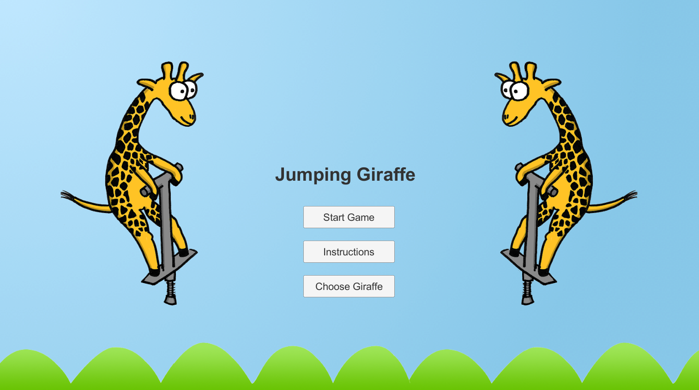
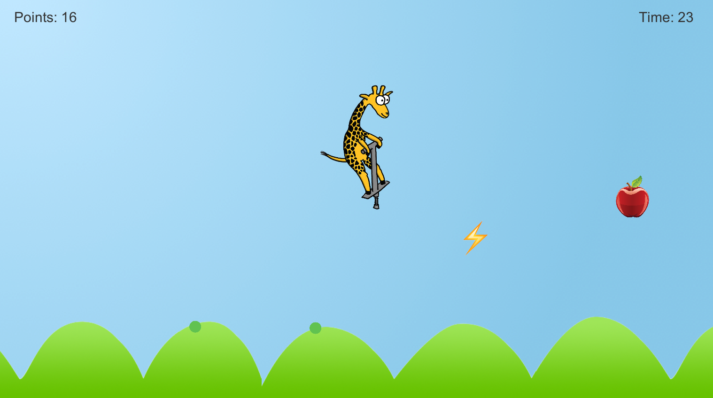

# Jumping Giraffe

Welcome! Jumping Giraffe is an infinite runner-style mobile game created with Unity. Keep up with the bigger, faster giraffes by hopping along the hills with your pogo stick. If you can go for 30 seconds, you catch up with them! Otherwise, you bounce off course and lose them. Pickup points and speedups, unlock achievements, work on your high score, or play the tutorial level for a little extra fun.

Created by: Casey Klecan and Alexandria Mar
